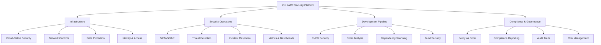
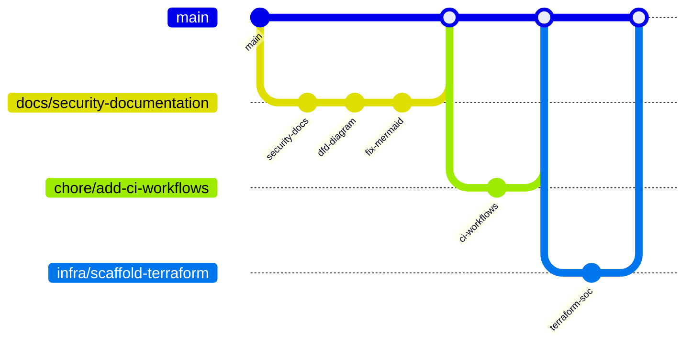

# IONKARE Security Modernization PRD

## Executive Summary
IONKARE's security modernization initiative transforms our healthcare coordination platform into a cloud-native, security-first solution that exceeds industry compliance requirements while delivering exceptional developer and security team experiences.

### Vision Statement
Enable healthcare teams to coordinate care securely and efficiently by providing a modern, compliant platform that's secure by default and transparent by design.

### Strategic Pillars
1. **Security as Code**: Infrastructure, policy, and compliance managed through version control
2. **Cloud Agnostic**: Consistent security baseline across AWS, Azure, and GCP
3. **Operational Excellence**: Automated detection, response, and compliance validation
4. **Developer Experience**: Security tools integrated into development workflow

## Product Structure



## Repository Organization

### Core Directories
```
IONKARE-APP-MODERNIZATION/
├── infrastructure/           # Multi-cloud IaC
│   ├── modules/             # Shared security modules
│   ├── aws/                 # AWS-specific stacks
│   ├── azure/               # Azure-specific stacks
│   └── gcp/                 # GCP-specific stacks
├── soc/                     # Security operations
│   ├── opensearch/          # SIEM components
│   ├── dashboards/          # Visualization
│   └── cloud/              # Cloud-native monitoring
├── automation/             # Security automation
│   └── soar/              # Response playbooks
├── detections/            # Detection rules
│   └── sigma/            # Sigma rules
├── docs/                 # Documentation
│   ├── product/         # Product strategy
│   ├── compliance/      # Compliance docs
│   └── soc-runbooks/    # SOC procedures
└── policy/              # Policy as code
    └── opa/            # OPA/Rego policies
```

## Feature Roadmap

### Phase 1: Foundation (Q1)
- [x] Security strategy documentation
- [x] Multi-cloud IaC scaffolding
- [x] CI security workflows
- [x] SOC tooling baseline
- [ ] Initial compliance mappings

### Phase 2: Implementation (Q2)
- [ ] AWS security baseline
  - [ ] CloudTrail, Config, GuardDuty
  - [ ] VPC Flow Logs, WAF
  - [ ] KMS encryption
- [ ] Azure security baseline
  - [ ] Defender for Cloud
  - [ ] Network Watcher
  - [ ] Key Vault
- [ ] GCP security baseline
  - [ ] Cloud Audit Logs
  - [ ] Security Command Center
  - [ ] Cloud KMS

### Phase 3: Operations (Q3)
- [ ] SIEM integration
- [ ] Custom dashboards
- [ ] Alert tuning
- [ ] Playbook automation
- [ ] Incident response testing

### Phase 4: Compliance (Q4)
- [ ] HIPAA technical controls
- [ ] SOC 2 readiness
- [ ] Automated evidence collection
- [ ] Compliance reporting

## Success Metrics

### Security Posture
- Mean Time to Detect (MTTD) < 15 minutes
- Mean Time to Respond (MTTR) < 1 hour
- Zero critical findings in external audits
- 100% of infrastructure defined as code

### Developer Experience
- < 5 minute CI security scan time
- < 1% false positive rate in SAST
- Zero-touch security for common patterns
- Same-day security review turnaround

### Operational Excellence
- 99.9% alert accuracy
- < 5% alert fatigue rate
- 100% automated compliance checks
- Zero manual security operations

## Stakeholder Requirements

### Development Teams
- Clear security requirements
- Fast feedback in CI/CD
- Self-service security tools
- Minimal workflow disruption

### Security Teams
- Complete visibility
- Automated response
- Evidence collection
- Policy enforcement

### Compliance/Risk
- Control documentation
- Audit readiness
- Risk reporting
- Continuous validation

## Implementation Guidelines

### Infrastructure
- Use Terraform modules for reusability
- Implement least-privilege by default
- Enable all relevant audit logs
- Automate compliance checks

### CI/CD Security
- Block on critical findings
- Parallel security scans
- Cached results when possible
- Clear remediation guides

### SOC Operations
- Centralized logging
- Correlation rules
- Automated enrichment
- Documented playbooks

## Future Considerations

### Potential Enhancements
- ML-based threat detection
- Chaos engineering
- Zero trust architecture
- Blockchain audit trails

### Research Areas
- Quantum-safe encryption
- Supply chain security
- Privacy-preserving analytics
- Federated identity

## Appendix

### Related Documents
- [SECURITY.md](../../SECURITY.md)
- [AI.md](../../AI.md)
- [CIS Benchmark Checklist](../cis-benchmark-checklist.md)

### Branch Strategy


### Pull Request Flow
1. Feature branch from main
2. CI security checks
3. Peer review
4. Security review if needed
5. Merge to main

### Release Process
1. Version tag on main
2. Security scan artifacts
3. Compliance validation
4. Deployment approval
5. Post-deploy verification
